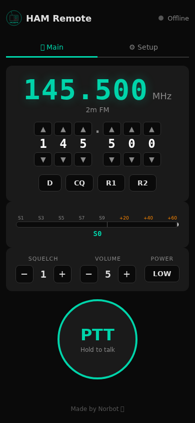

# 📻 HAM Remote

Web interface for remote operation of amateur radio transceivers from any browser. Mobile-first, dark theme, optimized for touch operation.

**Made by Norbot 🤖**



## Features

### 🎛️ Controls
- Frequency display with digit-by-digit tuning
- Squelch / Volume / TX Power controls
- Quick frequency buttons (DMR, Calling, Relays)
- Live S-Meter (S0 – S9+60, animated)
- RF / RX / TX level meter bars with LED-strip style gradient

### 🎙️ Audio
- **Bidirectional audio streaming (RX + TX) ✅ working**
- Raw PCM over WebSocket (16kHz mono)
- RX: Sound card → Server → Browser (live audio from radio)
- TX: Browser mic → Server → Sound card → Radio
- Half-duplex: RX pauses during TX
- Configurable audio devices (USB sound cards)
- Audio level metering with peak-hold and clipping detection

### ⌨️ PTT
- Hold-to-talk button (touch + mouse)
- Configurable keyboard hotkey (default: Spacebar)
- Persists across sessions

### 📡 Multi-Transceiver Support
- **Quansheng UV-K5** – via AIOC cable, 38400 baud
- **Yaesu FT-7800/FT-8300** – CAT protocol, 9600 baud, RS232 ✅ connected
- **Xiegu X6100** – USB-C (CAT + sound card), planned
- **Kenwood TS-2000** – RS232 CAT, planned
- Radio driver registry – easy to add more radios

### 🎨 UI
- Tab navigation: Main (operation) + Setup (configuration)
- Dark theme, mobile-first design
- Transceiver and audio device selection in Setup tab
- Audio level bars: RF (signal), RX (received audio), TX (microphone)
- Responsive – works on phone, tablet, and desktop

## Quick Start

```bash
# Clone
git clone https://github.com/3DFabrik/ham-remote.git
cd ham-remote

# Create virtual environment
python3 -m venv venv
source venv/bin/activate

# Install dependencies
pip install -r requirements.txt

# Run in simulation mode (no hardware needed)
python backend/app.py

# Run with real hardware
UVK5_SIMULATE=false python backend/app.py
```

Open **http://localhost:8080** in your browser.

### HTTPS (required for microphone access)

For remote access from another device, use a Caddy reverse proxy:

```
# /etc/caddy/Caddyfile
https://192.168.1.113:8444 {
    tls internal
    reverse_proxy 127.0.0.1:8080 {
        flush_interval -1
    }
}
```

Then open **https://192.168.1.113:8444** from your browser.

## Hardware Setup

### Yaesu FT-7800/8300
```
[FT-8300] ←RS232→ [FTDI USB Adapter] → [Server]
[FT-8300] ←Audio→ [Behringer PCM2902] → [Server]
                                        ↕
                                   Web Browser (Phone/Tablet)
```

**Tested with:**
- FTDI FT232 USB-to-Serial adapter → `/dev/ttyUSB0`
- Behringer PCM2902 USB Audio CODEC → ALSA Card 0 (`hw:0,0`)

### Quansheng UV-K5
```
[UV-K5] ←→ [AIOC] → USB → [Server]
                            ↕
                        Web Browser (Phone)
```

## Architecture

```
frontend/
  static/
    css/style.css    - Dark theme, LED-strip level bars
    js/app.js        - Frontend logic, WebSocket, audio playback
    img/logo.svg     - Logo
  templates/
    index.html       - Main page with tab navigation
backend/
  app.py             - Flask + SocketIO + radio drivers + audio engine
requirements.txt     - Python dependencies (flask, flask-socketio, pyserial, eventlet)
```

### Audio Pipeline (RX)
```
Radio → Behringer PCM2902 → arecord (16kHz S16_LE) → base64 PCM
    → Socket.IO audio_tx → Browser → AudioContext → Speaker
```

### Audio Pipeline (TX)
```
Browser Mic → MediaRecorder → Socket.IO audio_rx → Server → aplay → Behringer → Radio
```

## Supported Radios

| Radio | Connection | Protocol | Status |
|-------|-----------|----------|--------|
| Quansheng UV-K5 | AIOC USB | Serial 38400 baud | 🚧 In progress |
| Yaesu FT-7800/8300 | RS232 / FTDI | CAT 9600 baud | ✅ Connected, needs field test |
| Xiegu X6100 | USB-C | CAT + Sound card | 📋 Planned |
| Kenwood TS-2000 | RS232 | CAT 9600 baud | 📋 Planned |

Adding a new radio: create a class extending `UVK5Radio`, register it with `register_radio()`.

## Requirements

- Python 3.10+
- USB serial adapter (FTDI/CH340 for CAT control)
- USB sound card (Behringer PCM2902 or similar for audio)
- Caddy (for HTTPS reverse proxy, optional but needed for mic)
- Browser with WebSocket support

## Roadmap

- [x] ~~Audio level metering (RF/RX/TX bars)~~
- [x] ~~Live audio streaming (RX from radio)~~
- [x] ~~HTTPS via Caddy reverse proxy~~
- [x] ~~Yaesu FT-7800/8300 CAT driver~~
- [ ] Field test with FT-8300 (CAT control + audio)
- [ ] TX audio path (browser mic → radio)
- [ ] Xiegu X6100 support
- [ ] Kenwood TS-2000 support
- [ ] Authentication / login page
- [ ] Raspberry Pi deployment
- [ ] Docker packaging
- [ ] Hamlib integration (rotctld over TCP, port 4532)
- [ ] Memory channel management
- [ ] Band scope / waterfall display

## Known Issues

- **Zombie processes**: Server restarts may leave old Python processes on port 8080. Use `fuser -k 8080/tcp` before starting.
- **German locale**: `aplay -l` / `arecord -l` output is localized. Audio device parser handles both English and German.
- **Opus decoder**: Currently using raw PCM fallback. Opus decoder library loads from CDN but initialization can fail – PCM works reliably.

## License

MIT
